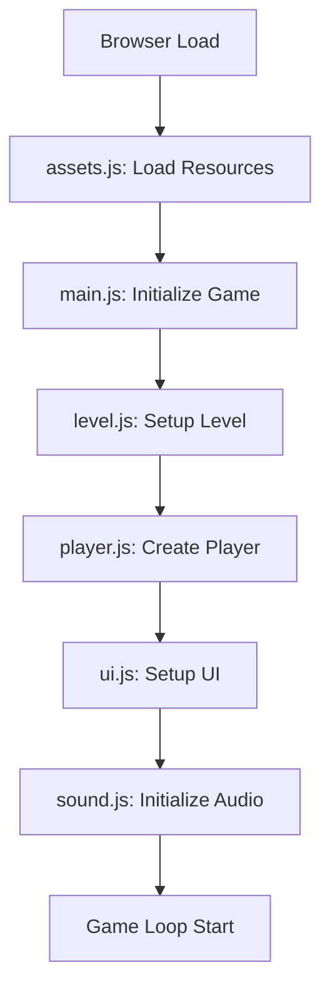
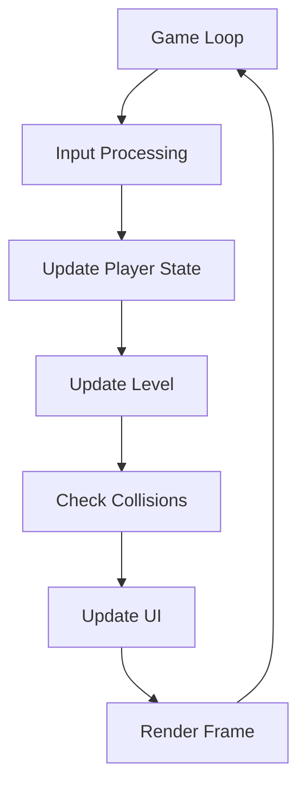
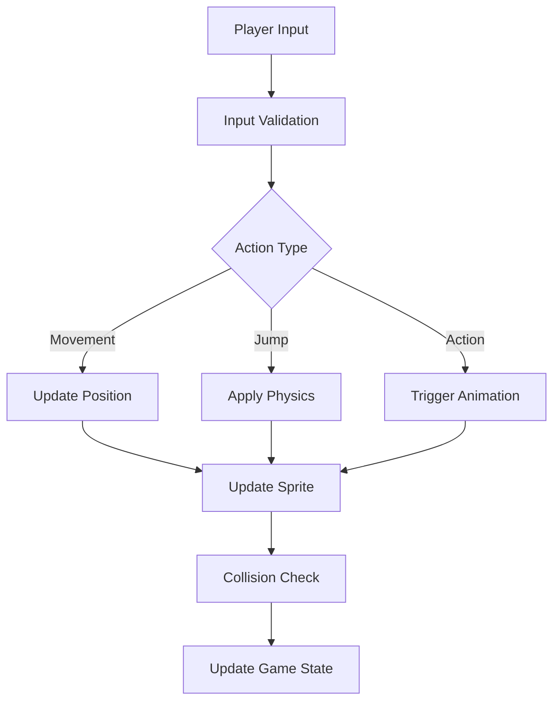
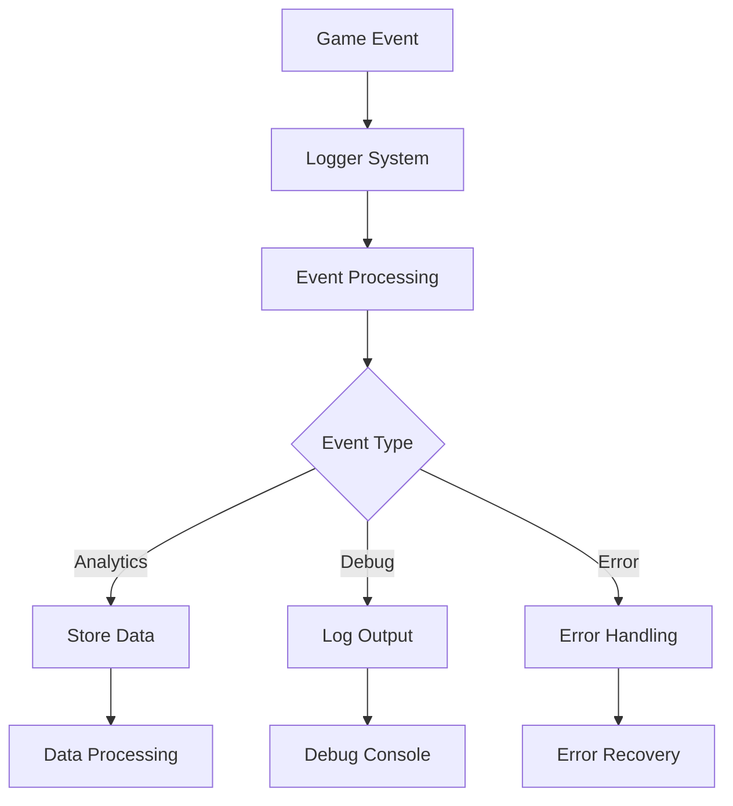

# System Documentation

## High-Level Overview

### 1. System Architecture

This codebase appears to be a gaming application, specifically a Mario-style game implementation using JavaScript for the frontend and Python for backend services. The system is divided into two main components:

#### A. Game Engine (Frontend)
- Built with vanilla JavaScript
- Modular architecture with separate components for:
  - Player mechanics
  - Level management
  - UI rendering
  - Sound system
  - Asset management
  - Background handling

#### B. Backend Services
- Python-based backend with various features:
  - Logger system
  - Testing frameworks
  - Agent integration capabilities
  - Streamlit integration for visualization

### 2. Core Components

#### Frontend Components
1. **Main Game Loop** (`main.js`)
   - Manages game initialization
   - Handles game loop and updates
   - Coordinates between different modules

2. **Player System** (`player.js`)
   - Controls player movement
   - Handles player states
   - Manages player interactions

3. **Level System** (`level.js`)
   - Level design and layout
   - Obstacle placement
   - Game environment management

4. **UI System** (`ui.js`)
   - Renders game interface
   - Manages score display
   - Handles menu systems

5. **Asset Management** (`assets.js`)
   - Loads and manages game resources
   - Handles sprite sheets
   - Manages audio assets

#### Backend Components
1. **Logger System**
   - Tracks game events
   - Manages debug information
   - Performance monitoring

2. **Testing Framework**
   - Integration tests
   - Unit tests for components
   - AI agent testing capabilities

## Low-Level Flow

### 1. Game Initialization Flow

### 2. Game Loop Flow

### 3. Player Interaction Flow

### 4. Backend Integration Flow

## Component Details

### 1. Asset Management System
- Preloads all game assets
- Manages resource caching
- Handles asset versioning
- Provides asset access APIs

### 2. Player System
- State machine for player actions
- Physics calculations
- Animation management
- Power-up handling

### 3. Level System
- Tile-based level design
- Dynamic obstacle generation
- Collision detection system
- Level progression logic

### 4. Sound System
- Background music management
- Sound effect triggering
- Audio state management
- Volume control

### 5. UI System
- Score display
- Health/Lives indication
- Menu rendering
- HUD management

## Technical Specifications

### Frontend
- Language: JavaScript (ES6+)
- Rendering: HTML5 Canvas
- Audio: Web Audio API
- Input: Keyboard/Touch events

### Backend
- Language: Python 3.x
- Testing: Python unittest
- Logging: Custom Python logger
- AI Integration: Various AI agents

## Development Guidelines

### Code Structure
- Modular component design
- Event-driven architecture
- Clear separation of concerns
- Consistent naming conventions

### Best Practices
1. Component isolation
2. Event-based communication
3. Resource optimization
4. Error handling
5. Performance monitoring

### Testing Strategy
1. Unit tests for components
2. Integration tests for systems
3. Performance benchmarks
4. AI agent testing

## Future Enhancements

1. Multiplayer capabilities
2. Advanced AI opponents
3. Additional level types
4. Enhanced graphics and effects
5. Mobile optimization

## Performance Considerations

1. Asset loading optimization
2. Frame rate management
3. Memory usage monitoring
4. Network optimization
5. Cache management

## Security Considerations

1. Input validation
2. Asset integrity
3. Error handling
4. Data validation
5. Security headers

This documentation provides both a high-level overview and detailed low-level flows of the system. The mermaid diagrams illustrate the key processes and interactions between different components.